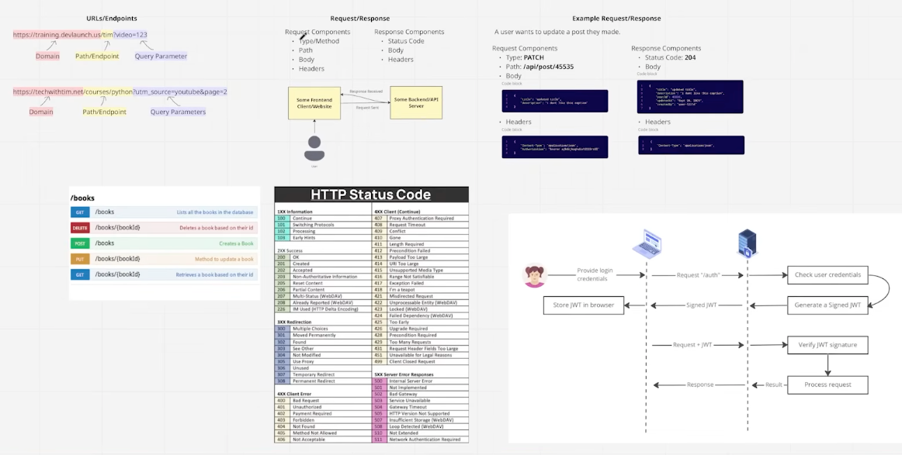

Coding exercises. Freely adapted from:

[Learn Fast API With This ONE Project Tech With Tim](https://www.youtube.com/watch?v=SR5NYCdzKkc)

Additional packages to install :
- uv add fastapi --extra standard
- uv add python-dotenv
- uv add 'fastapi-users[sqlalchemy]'  <!-- PLEASE notethe braket to savoid 'globbing' -->
- uv add imagektio
- uv add 'uvicorn[standard]'  <!-- PLEASE notethe braket to savoid 'globbing' -->
- uv add aiosqlite